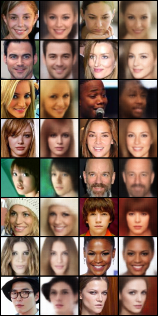
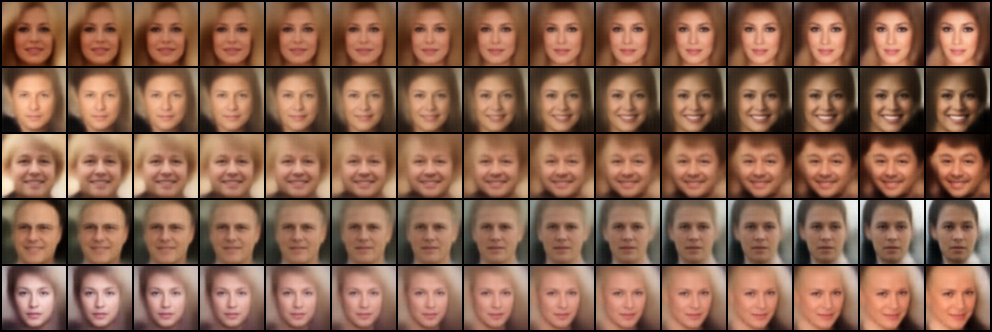
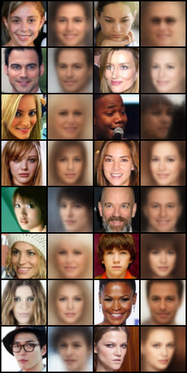
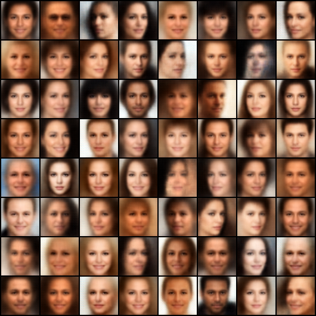
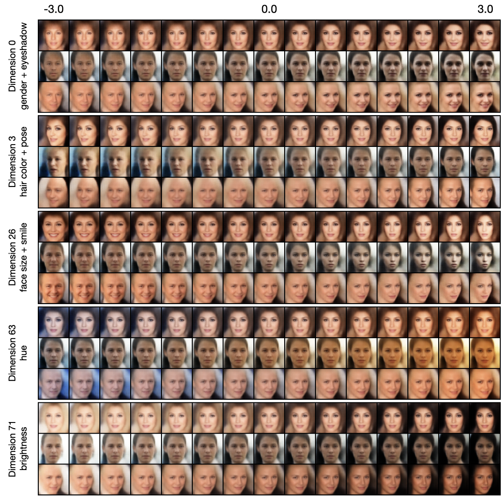

# VAEs-Implementations

Implement VAEs with PyTorch.


## Progress

- [x] VAE
- [x] $\beta$-VAE

<br/>


## Results


### VAE

> Kingma, Diederik P., and Max Welling. "Auto-encoding variational bayes." *arXiv preprint arXiv:1312.6114* (2013).

**Reconstruction and random samples (CelebA 64x64)**:

<p align="center">
    
    
</p>

**Interpolation in latent space (CelebA 64x64)**:

<p align="center">
    
</p>


### $\beta$-VAE

> Higgins, Irina, Loic Matthey, Arka Pal, Christopher Burgess, Xavier Glorot, Matthew Botvinick, Shakir Mohamed, and Alexander Lerchner. "beta-vae: Learning basic visual concepts with a constrained variational framework." In *International conference on learning representations*. 2016.

$\beta$-VAE introduces a hyperparameter $\beta$ to balance the reconstruction term and KL term in the loss function, where $\beta=1$ corresponds to the original VAE. Larger $\beta$ creates a trade-off between reconstruction fidelity and the quality of distanglement within the learnt latent representations.

**Reconstruction and random samples ($\beta=20$, CelebA 64x64)**:

<p align="center">
    
    
</p>

**Traverse along a dimension (CelebA 64x64)**:

<p align="center">
  
  
</p>

- By traversing along one dimension of the latent code and fixing other dimensions, we can find out which dimension controls what kind of semantic.
- The images are results of $\beta=0$ (left) and $\beta=20$ (right). It seems that $\beta=20$ has a less entangled representation (but I'm not sure...)


### MMD-VAE

> Zhao, Shengjia, Jiaming Song, and Stefano Ermon. "Infovae: Information maximizing variational autoencoders." arXiv preprint arXiv:1706.02262 (2017).

**Random samples and latent space visualization (MNIST 32x32, latent_dim=2)**:

<p align="center">
    
</p>

- Not really sure that MMD-VAE has a better latent space...


<br/>


## Run the code


### Train

For VAE:

```shell
accelerate-launch train_vae.py [-c CONFIG] [-e EXP_DIR]
```

For $\beta$-VAE:

```shell
accelerate-launch train_vae.py [-c CONFIG] [-e EXP_DIR] --train.coef_kl [BETA]
```


### Sample

For VAE and $\beta$-VAE:

```shell
python sample.py -c CONFIG \
                 [--seed SEED] \
                 [--mode {sample,interpolate,traverse,reconstruct,visualize_latent}] \
                 --weights WEIGHTS \
                 --n_samples N_SAMPLES \
                 --save_dir SAVE_DIR \
                 [--batch_size BATCH_SIZE] \
                 [--n_interpolate N_INTERPOLATE] \
                 [--n_traverse N_TRAVERSE] \
                 [--traverse_range TRAVERSE_RANGE] \
                 [--traverse_dim TRAVERSE_DIM]
```

- Choose a sampling mode by `--mode MODE`, the options are:
  - `sample` (default): Randomly sample images.
  - `interpolate`: Sample two random images and interpolate between them. Use `--n_interpolate` to specify the number of images in between.
  - `traverse`: Traverse along a specific dimension. Use `--n_traverse` to specify the number of traversed images, `--traverse_range` to specify the traversal range and `--traverse_dim` to specify the traversal dimension.
  - `reconstruct`: Reconstruct the input.
  - `visualize_latent`: Visualize the latent space. Only valid when z_dim=2.
