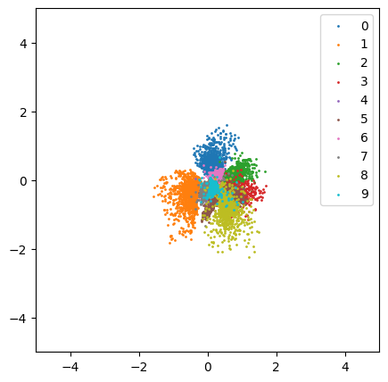
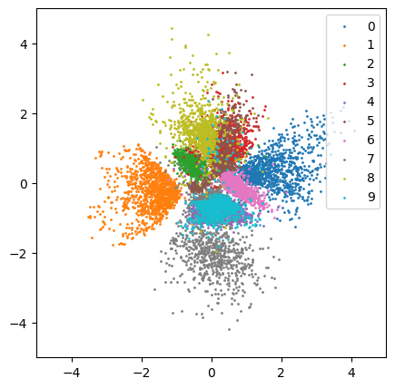
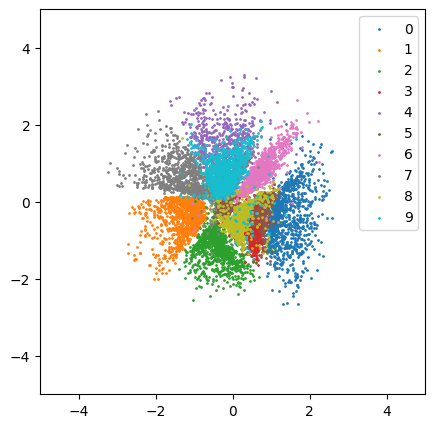
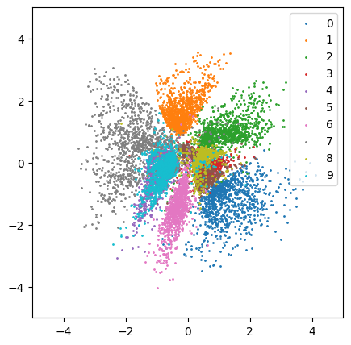
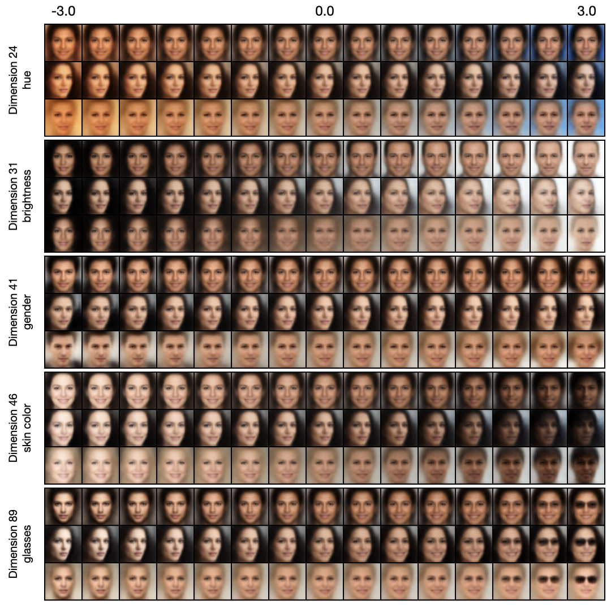
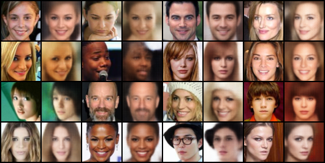
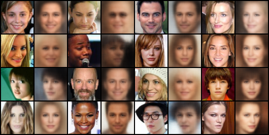
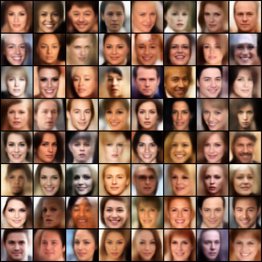
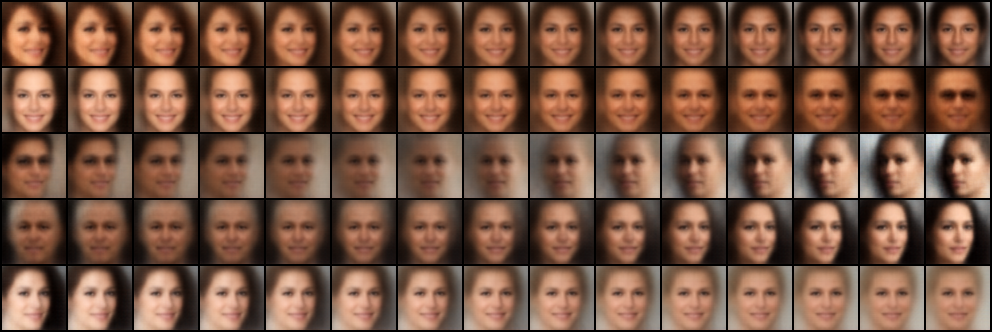

# VAEs-Implementations

Implement VAEs with PyTorch.


## Progress

- [x] [VAE](https://arxiv.org/abs/1312.6114)
- [x] [beta-VAE](https://openreview.net/forum?id=Sy2fzU9gl)
- [x] [AAE](http://arxiv.org/abs/1511.05644)
- [x] [MMD-VAE](https://arxiv.org/abs/1706.02262)

<br/>


## Latent Space Visualization

To visualize the latent space learned by these models, I train them on **MNIST** dataset with a **2 dimensional latent space**. After training, I encode the data in MNIST test set (10,000 images, 1,000 for each class) using the trained encoder and visualize the latent codes on a 2-D plane, coloured by their labels.

<table style="text-align:center">
    <tr>
        <th>AE</th>
        <th>VAE</th>
        <th>AAE</th>
        <th>MMD-VAE</th>
    </tr>
    <tr>
        <td></td>
        <td></td>
        <td></td>
        <td></td>
    </tr>
</table>

- The latent space of AE (autoencoder) is not regularized and is solely learned from reconstructing the data.
- The latent space of VAE is regularized by $\text{KL}(q_\phi(z\vert x)\Vert p(z))$, which encourages the encoder to map all the input to the same prior distribution (usually the standard normal distribution).
- The latent space of AAE is regularized by $\text{JS}(q_\phi(z)\Vert p(z))$ via adversarial training. Only the amortized distribution of the latent codes is encouraged to approach the prior distribution.
- Similar to AAE, MMD-VAE (a special case of InfoVAE) is regularized by $\text{MMD}(q_\phi(z)\Vert p(z))$. However, the latent space distribution does not seem to be as good as AAE.

<br/>


## Disentanglement Study

By traversing along one dimension of the latent code while fixing the other dimensions, we can find out which dimension controls which type of semantic attribute. Ideally, in a well-disentangled latent space, each dimension only controls a single type of attribute, such as smiling, wearing glasses, hue, etc.

<table style="text-align:center">
    <tr>
        <th>VAE</th>
        <th>beta-VAE (beta=20)</th>
    </tr>
	<tr>
    	<td></td>
        <td></td>
    </tr>
</p>
</table>

- beta-VAE introduces a hyperparameter $\beta$ to reweight the reconstruction term and KL term in the VAE loss function, where $\beta=1 $ corresponds to the original VAE. Larger $\beta$ creates a trade-off between reconstruction fidelity and the quality of distanglement within the learned latent representations.

<br/>


## Unconditional Image Generation


### CelebA (64x64)

**Reconstruction**:

<table style="text-align:center">
    <tr>
        <th>VAE</th>
        <th>beta-VAE (beta=20)</th>
    </tr>
    <tr>
        <td></td>
        <td></td>
    </tr>
</table>

**Random samples**:

<table style="text-align:center">
    <tr>
        <th>VAE</th>
        <th>beta-VAE (beta=20)</th>
    </tr>
    <tr>
        <td></td>
        <td></td>
    </tr>
</table>


**Interpolation**:

<table style="text-align:center">
    <tr>
        <th>VAE</th>
        <th>beta-VAE (beta=20)</th>
    </tr>
    <tr>
        <td></td>
        <td></td>
    </tr>
</table>


<br/>


## Run the code


### Train

For AE:

```shell
accelerate-launch train_ae.py [-c CONFIG] [-e EXP_DIR]
```

For VAE:

```shell
accelerate-launch train_vae.py [-c CONFIG] [-e EXP_DIR]
```

For $\beta$-VAE:

```shell
accelerate-launch train_vae.py [-c CONFIG] [-e EXP_DIR] --train.coef_kl {BETA}
```

For AAE:

```shell
accelerate-launch train_aae.py [-c CONFIG] [-e EXP_DIR]
```

For MMD-VAE:

```shell
accelerate-launch train_mmd_vae.py [-c CONFIG] [-e EXP_DIR]
```


### Sample

For VAE, $\beta$-VAE, AAE and MMD-VAE:

```shell
python sample.py -c CONFIG \
                 [--seed SEED] \
                 [--mode {sample,interpolate,traverse,reconstruct,visualize_latent}] \
                 --weights WEIGHTS \
                 --n_samples N_SAMPLES \
                 --save_dir SAVE_DIR \
                 [--batch_size BATCH_SIZE] \
                 [--n_interpolate N_INTERPOLATE] \
                 [--n_traverse N_TRAVERSE] \
                 [--traverse_range TRAVERSE_RANGE] \
                 [--traverse_dim TRAVERSE_DIM]
```

- Choose a sampling mode by `--mode MODE`, the options are:
  - `sample` (default): Randomly sample images.
  - `interpolate`: Sample two random images and interpolate between them. Use `--n_interpolate` to specify the number of images in between.
  - `traverse`: Traverse along a specific dimension. Use `--n_traverse` to specify the number of traversed images, `--traverse_range` to specify the traversal range and `--traverse_dim` to specify the traversal dimension.
  - `reconstruct`: Reconstruct the input.
  - `visualize_latent`: Visualize the latent space. Only valid when z_dim=2.
